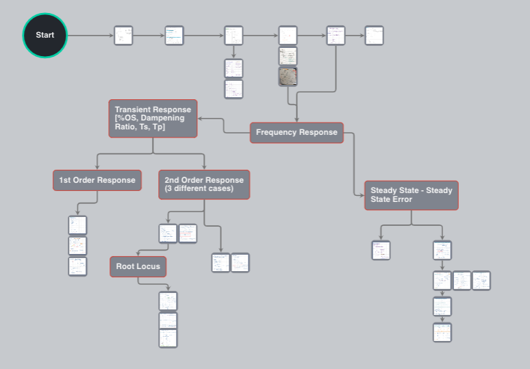

# Engineering & Capital Markets (WIP) 🌓 
  
Please Note this project is still a work in progress  
Current Progress can be seen with this GCP deployment [deployment](https://capital-markets-engineering.uk.r.appspot.com/JacobClaessens/CapitalMarkets/)

  
A Visual Map of realtime economic data that can interacted with and editted by the user.  

A Mind Map of Control Systems mathematics / analysis that  is interactive and can be editted by the user.  